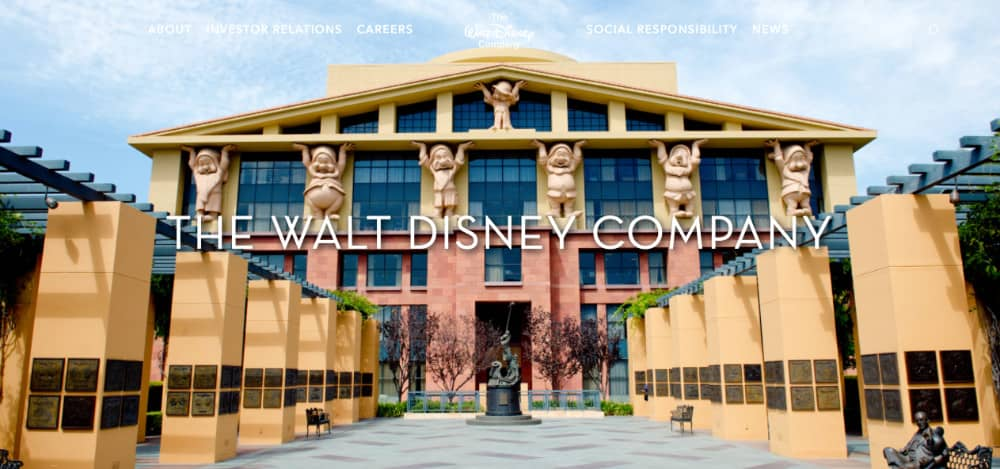

# 01 - Introduction.

## Qu'est-ce que WordPress ?

WordPress est un système de gestion de contenus permettant de créer son propre site assez facilement. En plus de sa simplicité d’utilisation, il présente de nombreux autres atouts. C'est un cms.

WordPress a été créé en 2003 mais ses origines remontent à 2001, lorsque Michel Valdrighi crée son logiciel b2. On considère que WordPress est un “Fork”, c’est à dire qu’il n’est pas un logiciel créé de toutes pièces, il est l’évolution d’un logiciel déjà existant. b2 ne s’est d’ailleurs pas éteint avec l’arrivée de WordPress, puisque b2evolution a été créé, et existe toujours.  Le b2 qui a donné naissance à WordPress s’appelait b2/cafelog. Cet Open Source constituait une plateforme de blogs, permettant à chacun de se créer une page sur Internet. Il fonctionnait avec le langage de programmation php, et à l’aide de MySQL comme système de gestion de ses bases de données.  L’histoire de WordPress, c’est aussi et surtout Matthew Mullenweg qui âgé seulement de 20 ans et dès 2004 développe WordPress et fonde la société d’édition de logiciel Automattic en 2005.

### Mais donc, qu'est-ce qu'un cms ?

Le système de gestion de contenu (SGC) ou Content Management System (CMS) en anglais regroupe une catégorie de logiciels qui permettent de concevoir, gérer et mettre à jour des sites Web ou des application mobile de manière dynamique.

### Pourquoi l'utiliser ?
Très accessibles, les CMS représentent un vrai gain de temps et d'énergie pour asseoir une présence sur internet. Ils permettent en effet de créer et personnaliser un site web très rapidement, sans même maîtriser les langages informatiques. C'est pourquoi de plus en plus de professionnels utilisent un CMS, des pure players de l'e-commerce jusqu'aux grandes entreprises B2B.

### Avantages d'un cms :

* Créer et gérer un site d'entreprise en interne sans connaissances techniques 
* Produire facilement du contenu optimisé pour le SEO avec un CMS 
* Développer rapidement la visibilité d'une marque sur le net 
* Construire un site évolutif

## De grands groupes qui utilisent WordPress :

### [The Walt Disney Compagny](https://thewaltdisneycompany.com/)

Le site vitrine de la fameuse entreprise et de la célèbre souris dont l'objectif est de produire et de fournir du divertissement dans le monde entier.

Le site est relativement simple avec plusieurs catégories dont "actualités" qui constitue un blog.

### [The White House](https://www.whitehouse.gov/)

Le site de la Maison Blanche réunit les dernières actualités concernant le président des États-Unis et les domaines de l’économie, de la sécurité nationale, du budget, de l’immigration et de la santé.

### [BBC America](https://www.bbcamerica.com/)

BBC America est une chaîne de télévision américaine appartenant à BBC WorldWide. Elle a notamment réalisé les séries Top Gear et Doctor Who.

Le site propose un large panel de vidéos, on retrouve les liens vers les réseaux sociaux et un module de connexion à un espace personnel.

### D'autres examples :

[Le Royal Monceau Paris](https://www.leroyalmonceau.com/)

[Le blog Playstation](https://blog.fr.playstation.com/)

[Vogue](https://www.vogue.fr/)

[Le groupe Renault](https://www.renaultgroup.com/)

[LVMH (Groupes publiciaire)](https://www.lvmh.fr/)

[The New York Times](https://www.nytimes.com/)

[Bioptimisation 2020](https://www.bioptimisation2020.fr/)

---
- [2. Mise en place](./02-Mise-en-place.md)

