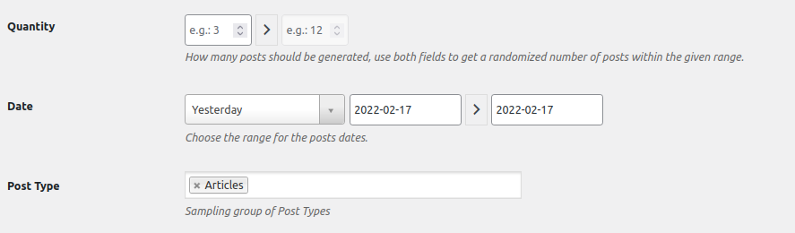

# 04 - Dashboard.

## Créations de page.

Maintenant rendez-vous dans le dashboard à la section Pages > Ajouter et créez une page Accueil, une page Blog, puis une page Contact. Indiquez pour chacune le titre, au moins un paragraphe puis publiez-les.

## Créations de catégories.

Nous allons nous rendre une nouvelle fois dans le dashboard dans Article -> catégories. Créer trois catégories de votre choix.

Il y a divers exemples de catégories : film, manga, photo, série, famille, amis, vacances, ect.

## Page d'acceuil.

Par défaut WordPress affiche le blog en page d’accueil et quand on fait un site (et pas qu’un blog) ce n’est pas ce que l’on veut. Du coup en prévision de la suite on va aller changer ça. Rendez-vous dans Réglages > Lecture puis sélectionnez La page d’accueil affiche : Une page statique. Assignez ensuite Accueil en page d’accueil, et Blog en page des articles.

## FakerPress.

Depuis votre interface d’administration, rendez-vous dans Extensions > Ajouter puis recherchez FakerPress (sans espace). 

Télécharger-le et activer-le ensuite.

FakerPress va nous gagnez du temps en créeant de faux articles en Lorem Ipsum, vous pouvez bien sur créer les votres à votre convenances.

### Utilisation

Une fois installée, une nouvelle entrée apparait en bas du menu WordPress. Cliquez sur cette entrée FakerPress > Articles.  

Commander à l'extension de créer :

* une vingtaine d'articles
* Date : publiés entre il y a un an et aujourd’hui (entrez les dates manuellement)
* Post Type : dans les articles  

* Auteur : vous-même  

* Taxonomies : Catégories seulement
* Nombre : 1 seule par article

---

- [3. Bases](./03-Bases.md)
- [5. Templates hierachie](./05-Templates-hIerachie.md)
